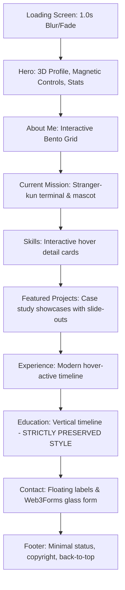

# Redesign Plan: Premium Dark Portfolio (`tnishx`)

This plan details the architecture, design tokens, and module structures for the portfolio redesign of **Tanish (`tnishx`)**. The goal is to build an interactive, high-performance website inspired by modern design leaders like Linear, Apple, Vercel, Rauno, and Stripe.

---

## 🎨 Visual Identity & Styling

### 1. Color Palette & Depth
- **Theme**: Pure Sleek Dark Mode (never flat black).
- **Backgrounds**:
  - Main: `#030503` (deep forest-black)
  - Secondary/Alternative: `#060b06`
  - Cards: `rgba(10, 16, 10, 0.4)` (with glassy border `rgba(93, 209, 40, 0.08)`)
- **Primary Accent**: `#5DD128` (Lime Green, used sparingly for focus, active state, and glow).
- **Secondary Greens**: 
  - Emerald glow: `#0ea47a`
  - Forest base: `#092209`
- **Typography Colors**:
  - Headings: `#ffffff` (Space Grotesk)
  - Body Text: `#9ca3af` (Inter, comfortable reading contrast)
  - Muted: `#6b7280`

### 2. Micro-Textures & Glow
- **Grain Overlay**: An ultra-fine SVG noise texture overlaying the entire screen at 2.5% opacity, creating a tactile, expensive finish.
- **Spotlight Gradient Blobs**: CSS-animated radial gradients (`background: radial-gradient(circle, rgba(93,209,40,0.06) 0%, transparent 70%)`) floating in the background, plus a cursor spotlight that follows the mouse with smooth spring damping (lerp).
- **Glassmorphism**: Backdrop blurs (`backdrop-filter: blur(20px)`) with thin, semi-transparent borders that light up when hovered.

---

## 🏗️ Interactive Page Architecture

---

## 💎 Features & Interactions

### 1. Elegant Loading Screen
- **Logo animation**: The monogram symbol and wordmark scale up slightly while changing opacity.
- **Sleek progress bar**: A thin lime-green loading line that animates from 0% to 100% in exactly 900ms.
- **Blur transition**: On load complete, the screen blurs and fades out (`filter: blur(20px) opacity(0)`) while shifting upwards, revealing the hero.

### 2. Floating Navigation
- **Responsive design**: Sits in a floating container at top center. Shrinks and changes border glow on scroll.
- **Magnetic sliding active line**: A single indicator element in the nav background that smoothly slides underneath the hovered or active link, utilizing physics-like transitions (rather than jumping or individual lines).
- **Premium mobile nav**: Fades in with a fullscreen blur overlay and slides menu items in with staggered reveals.

### 3. Hero Section
- **Aesthetic**: Typography-led storytelling. Large bold text using Space Grotesk.
- **3D Interactive Profile Wrap**: A glowing, border-animating frame holding Tanish's image. On hover, it tilts in 3D perspective based on mouse coordinates.
- **Magnetic Elements**: Social link icons and action buttons contain interactive magnetic pull.
- **Stats Counters**: Interactively increment from 0 to target values (e.g. 12+ Projects, 15+ Tech, 450+ Coffee, 4+ Years Learning) when entering screen.

### 4. About Me Bento Grid
- A CSS Grid layout featuring four premium glassmorphic cards:
  1. **Philosophy Card** (Double width): Narrative detailing obsession with micro-interactions, layout transitions, and fluid UX.
  2. **Elder Sibling Card**: Sibling dynamics analogy for handling codebase chaos, deadlock resolutions, and multitasking.
  3. **Discipline Card**: Visualizing calisthenics, football, and transferrable habits (persistence, physical control).
  4. **Niche Card**: Clickable, rotating, or glowing tech interests (Web3, compilers, custom automation, performance tuning).

### 5. Current Mission: Stranger-kun
- Styled to look like a high-end compiler control console.
- **Left Panel**: A terminal emulator printing real-time compiler outputs, bundler logs, socket connection attempts, and build confirmations, cycling in a realistic loop.
- **Right Panel**: Glass container showing:
  - Mascot (`kita-kun.png`) floating with a soft hover scale.
  - Active pulsing status badge (`● BUILD_IN_PROGRESS`).
  - Tech tags (React.js, Socket.io, Node.js, WebRTC).
  - A beautiful animated progress bar indicating 74% completeness.

### 6. Skills Deck
- Category cards (Frontend, Backend, Languages, Workflows, Systems) that expand on click/hover.
- Uses dynamic glowing circular rings or bar progress bars that animate from 0% to skill levels on viewport entering.

### 7. Featured Projects
- Case study style product showcases.
- Zooming, parallax image wrapper.
- **View Case Study slide-out**: Clicking a project slides in an overlay card with detailed metrics, architecture diagrams (in CSS), challenges, and solutions, plus direct links to Live Demo and GitHub.

### 8. Experience Timeline
- Minimal modern vertical timeline where entries light up in green-glow on hover, displaying company, accomplishments, and tech tags.

### 9. Education Timeline (Preserved)
- **STRICTLY UNCHANGED DESIGN**: The HTML structure, vertical timeline style, colors, dot layout, and font spacing will be kept functionally identical to the user's current timeline to respect the design freeze of this specific component.

### 10. Contact Form & Footer
- **Glassmorphic inputs**: Inputs with floating labels that smoothly slide up and shrink when active/focused.
- **Web3Forms integration**: Retain the existing API integration, showing a custom glass success alert.
- **Resume download & Socials**: Beautiful hover states with glowing green borders.

---

## 🛠️ Code Structure

### `index.html`
- Links to Space Grotesk & Inter google fonts.
- Includes FontAwesome, GSAP, and Lenis via reliable, fast CDNs.
- Semantic markup structure (`<header>`, `<main>`, `<section>`).

### `style.css`
- Organized into clear blocks: Custom Properties, Reset, Utility Classes, Global Layout, Section Layouts, Micro-interactions, Components, and Responsive Queries.
- Glassmorphism utility classes (`.glass-panel`, `.glow-card`).
- Layout-shift-free CSS.

### `script.js`
- Modular JavaScript structure.
- **Modules**:
  - Loading Screen Manager
  - Smooth Scroll (Lenis init)
  - Custom Text Splitter (for GSAP text reveal animations without SplitType CDN bloat)
  - Magnetic Physics (LERP implementation for `.magnetic`)
  - Cursor Radial Glow
  - Stats Auto-Counter
  - Terminal Simulator (typing fake deployment logs)
  - Bento Interactive Effects & Project Slide-outs
  - Form validation & Toast notifications
  